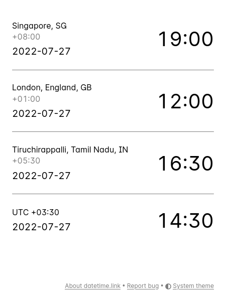
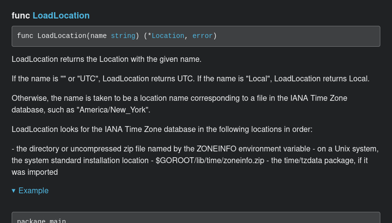

# Turning cities into time

Created: July 23, 2022 12:21 PM
Incomplete: No
Story Type: Non-Fiction
Tags: Presentation, Technology

# Turning cities into time

My adventures in cities and dates and time

---

# But first, back in time…

---

# datetime.link

A work-in-progress date & time link:

- [https://datetime.link/now/Singapore-SG](https://datetime.link/now/Singapore-SG)
- [https://datetime.link/2022-07-27T11:00Z/Singapore-SG](https://datetime.link/2022-07-27T11:00Z/Singapore-SG)
- [https://datetime.link/2022-07-27T19:00+08:00/Singapore-SG,London-England-GB,Tiruchirappalli-Tamil_Nadu-IN,+03:00](https://datetime.link/2022-07-27T19:00+08:00/Singapore-SG,London-England-GB,Tiruchirappalli-Tamil_Nadu-IN,+03:00)



---

# Goal

- User visits https://datetime.link
- User searches for a city
- Each city is assigned a human-readable ID
- Look up time in that city

A few hours of coding, right? 


Giphy

---

# Getting a list of cities

- Downloadable database instead of a city API
    - Self-contained, no other costs except for hosting
    - Must map to timezone information
    - Sufficient city names, not just timezone names


Giphy

I found GeoNames!

- Has timezones! In tz format too!
- Has alternate names!
- License: Creative Commons Attribution 4.0

(Do you know of any alternatives?)

---

# GeoNames

- User-editable database of points of interest
- Provides a dump of information in tab-seperated files
- Each place is organised by a hierarchy
    - country
    - admin1 (administrative level 1)
    - admin2/city
    - admin3
    - admin4
    - admin5
- Provides alternative names and timezone
- Guide: [http://download.geonames.org/export/dump/readme.txt](http://download.geonames.org/export/dump/readme.txt)

](https://upload.wikimedia.org/wikipedia/commons/thumb/2/25/Geonames4.png/640px-Geonames4.png)

Density of GeoNames information. [Source: Wikimedia](https://en.wikipedia.org/wiki/GeoNames#/media/File:Geonames4.png)

---

# GeoNames city data snippet


---

# tz database

- An ICANN-supported database of timezones
- Shipped with most Linux distributions
- Supported by the Go `time` package
- Format: Continent/City
    - Asia/Singapore
    - America/New_York

---

# Assigning an identifier

- I wanted each city to be referenced directly in a URL while remaining **human-readable**
    - https://datetime.link/now/Singapore,London

- But there are cities with the same name but different region or country
    - Paradise, California, US
    - Paradise, Nevada, US
- Join city, admin1 and country. Ignore admin1 when same as country name
    - `Singapore-SG, Slough-England-GB, Albany-New_York-US`
- In the future, add option to pick the more populous city


---

# Relaxed searches

- I wanted to keep `alternatenames` for cities, admin1 and country so I could later implement fuzzy search
- Because `alternatenames` sometimes have very similar or duplicates, I filtered some out
- Example: SIN,Sin-ka-po,Singapore,Singapore City,Singapour,Singapur,Sin gapura,Sinkapoure,Sîn-kâ-po,Tumasik,cinkappur,prathes singkhpor,shingaporu,sigapura,sing-gapo l,sing-gapoleu,singapura,singkh por,sngapwr,snghafwrt,syngpwr,xin jia po,xing jia po,Σιγκαπού ρη,Сингапур,Сінгапур,סינגפור,ﺲﻨﻏﺎﻓﻭﺭﺓ,ﺲﻧگﺍپﻭﺭ,सिंगापुर,सिंगापूर,ਸਿੰਗਾਪੁਰ,சிங்கப்பூர்,ประเทศสิงคโปร์,สิงค์โปร,ປະເທດ ສງກະໂປ,ປະເທດສິງກະໂປ,စငကာပနငင,စင်ကာပူနိုင်ငံ,សងហបរ,សិង្ហបុរី,シンガポール,新加坡,星架坡,싱가포르,싱가폴
- Search is something I haven't implemented, but would have been really easy if I instead threw all the data into a database. But no, I want to challenge myself. That's the fun part of side projects!

---

# Processing the GeoNames data

```go
func readCities(f string, countries map[string]data.Country, admin1s map[string]data.Admin1) (map[string]*data.City, error) {
	file, err := os.Open(f)
	...
	r := csv.NewReader(file)
	r.Comma = '\t'
	r.Comment = '#'
	m := make(map[string]*data.City)
	for {
		...
		name := record[1]
		ref := normalizeName(record[2])
		alternateNames, err := limitNames(name, splitNames(record[3]))
		...
		admin1Code := record[10]
		countryRef := record[8]
		population, err := strconv.ParseUint(record[14], 10, 64)
		...
		timezone := record[17]
		...
		country := countries[countryRef]
		admin1 := admin1s[countryRef+"."+admin1Code]
		eref := extendRef(ref, admin1.Ref, country.Ref)
		...
		c := &**data.City{
			Ref:            ref,
			Name:           name,
			AlternateNames: alternateNames,
			Timezone:       timezone,
			Population:     population,
			Admin1:         admin1,
			Country:        country,
		}**
		...
	}
}

func main() {
	admin1s, err := readAdmin1Divisions("../third-party/admin1CodesASCII.txt")
	...
	countries, err := readCountries("../third-party/countryInfo.txt")
	...
	cities, err := readCities("../third-party/cities15000.txt", countries, admin1s)
	...
	b, err := json.Marshal(cities)
	...
	err = ioutil.WriteFile("../data/cities.json", b, 0644)
}
```

---

# Result

Now I have an ASCII-based key for every city, and their alternate names and timezone!

```json
{
  ...
  "Albany-Georgia-US": {
    "n": "Albany",
    "an": [
      "City of Opportunity",
      "albany  jarjya",
      "Олбани",
      "ao er ba ni",
      "olbeoni",
      "orubani",
      "albani"
    ],
    "t": "America/New_York",
    "p": 74843,
    "a1": {
      "n": "Georgia"
    },
    "c": {
      "r": "US",
      "n": "United States"
    }
  },
  ...
  "Singapore-SG": {
    "n": "Singapore",
    "an": [
      "Σιγκαπούρη",
      "prathes singkhpor",
      "Сингапур",
      "Singapore City",
      "sing-gapoleu",
      "xing jia po",
      "Sîn-kâ-po",
      "Sinkapoure",
      "singkh por",
      "shingaporu",
      "Sin-ka-po"
    ],
    "t": "Asia/Singapore",
    "p": 3547809,
    "a1": {
      "n": ""
    },
    "c": {
      "r": "SG",
      "n": "Singapore"
    }
  },
  ...
}
```

---

# Resolving timezones

- How do I get from a tz database timezone (“Asia/Singapore”) into a time?
- Go support tz database timezones natively!


Giphy

```go
	...
	// Parse time portion
	var t time.Time
	timeString := "2022-07-27T00:00Z"
	...
	for _, f := range timeFormats {
		t, err = **time.Parse(f, timeString)**
		if err == nil {
			break
		}
	}
	...
	loc, err := **time.LoadLocation("Asia/Singapore")**
	...
	timeInSingapore := t.In(loc) // So easy!
	log.Printf("%s", timeInSingapore)
```

---

# How Go resolves timezones



- Can't use system timezone database on Windows ([https://github.com/golang/go/issues/38453](https://github.com/golang/go/issues/38453))
    - Solution: `import _ “time/tzdata”` or `go build -tags timetzdata`
- In [JavaScript](https://developer.mozilla.org/en-US/docs/Web/JavaScript/Reference/Global_Objects/Intl/DateTimeFormat/DateTimeFormat#timezone), most browsers ship with an embedded IANA timezone database. However, the specification does not require implementations to do so.
- In Dart, the standard library does not support timezones other than local and UTC, because there’s no guarantee that the system Dart code is running in has a timezone database. There are Dart packages that do so though.

---

# datetime.link

A work-in-progress date & time link:

- [https://datetime.link/now/Singapore-SG](https://datetime.link/now/Singapore-SG)
- [https://datetime.link/2022-07-27T11:00Z/Singapore-SG](https://datetime.link/2022-07-27T11:00Z/Singapore-SG)
- [https://datetime.link/2022-07-27T19:00+08:00/Singapore-SG,London-England-GB,Tiruchirappalli-Tamil_Nadu-IN,+03:00](https://datetime.link/2022-07-27T19:00+08:00/Singapore-SG,London-England-GB,Tiruchirappalli-Tamil_Nadu-IN,+03:00)

Why Go:

- I didn't need to use many dependencies to achieve my goal
    - The stdlib has so much goodies
- Fast and simple

Future improvements:

- City or zone search
- Time picker screen
- User can add more clocks when viewing a link

(I’m really slowly building it)

[https://github.com/serverwentdown/datetime.link](https://github.com/serverwentdown/datetime.link)
